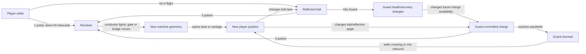

# Clockwork Tower: Kinetic Circuit — Phase 1 redesign plan

**Status at Phase 1:** design only. No gameplay, scene, UI, audio, or test code was changed for this plan. Paths below identify the two audited projects separately: **Relay** is this tracked repository root; **Current** was `/Users/yangruimeng/Desktop/slop/slop-current/`. The subsequent implementation and test evidence are recorded in Section 18.

## 1. Code audit

### Project identity and evidence

| Project | Verified entry point | What a player currently gets |
| --- | --- | --- |
| Relay | `project.godot` → `scenes/game.tscn` → `scripts/game.gd` | A 2,720-pixel, mostly horizontal ram–shutter–carriage return route. Permanent free dash and downward strike, no health attrition, title/paused/completion overlays, timer/attempt/dash HUD. |
| Current | `project.godot` → `scenes/clockwork_tower.tscn` → `scripts/clockwork_tower.gd` | An **already implemented** four-chamber scene named *Clockwork Tower: Kinetic Circuit*. It rises left, then right, then right through four charged sockets and shutters; three enemy roles are Guard, Shooter, and Titan. It starts directly in play, with no title screen. |
| Current, preserved older scenes | `scenes/kinetic_prototype.tscn` → `scripts/kinetic_prototype.gd`; `scenes/game.tscn` → `scripts/game.gd` and `scripts/level.gd` | The long 13-region combat/platforming course and original two-level ascent. They are useful code and regression references, not layouts for the new playable route. |

The `README.md`, `GAME_PLAN.md`, `KINETIC_LEVEL_DESIGN.md`, `CHANGELOG.md`, and `AGENTS.md` in **both** projects were inspected. Documentation is useful history; the behaviors below come from code. Both scene files are thin script wrappers: most assembly and presentation live in scripts. In Current, `CHANGELOG.md` already records the four-chamber build as Unreleased. This plan does not revise that history. Future player-visible implementation must add a new Unreleased entry, even if it replaces an existing feature.

### Behavior trace: file, function, signal, state, collision/event flow

| System | Source-level trace and actual behavior |
| --- | --- |
| Relay player and rebound | Relay `scripts/player.gd` `_physics_process`, `_check_strike`, `_check_dash_impact`; `rebounded`, `dash_connected`, `died`. Buffered jump/coyote state, timed downward strike, free directional dash, and contact grace live here. Strike shape queries layer 16; accepted receivers get horizontal momentum, then player gets fixed vertical rebound and inherited receiver velocity. No health or double jump in this player. |
| Relay ram charge | Relay `scripts/enemy.gd` `_physics_process`, `_check_kinetic_receiver`, `receive_kinetic_strike`, `receive_kinetic_dash`; `kinetic_impact`, `wall_rebounded`, `touched_player`. `idle → windup → coast → recover`; facing locks when windup begins. Group-based proximity checks forward kinetic receivers; their return velocity changes the ram. Body contact kills unless dash/strike/grace applies. |
| Relay gate and carriage | Relay `scripts/kinetic_gate.gd` `receive_kinetic_impact`/`opened` opens above speed 120; weaker impact rebounds. Relay `scripts/moving_platform.gd` `receive_kinetic_impact`, `receive_kinetic_strike`, `receive_kinetic_dash`, `_physics_process`; `direction_reversed`, `stop_rebounded`. It coasts with friction, carries the player as a solid body, rebounds at stops, and can be corrected directly. Relay `scripts/game.gd` `_on_carriage_reversed` deploys the exit after prior advance. These are a useful interaction pattern, but the whole rail pursuit is a recognizable old game. |
| Relay checkpoints/reset | Relay `scripts/game.gd` `_set_checkpoint`, `_on_player_died`, `_reset_world`. Phase 0–3 restores specific ram/carriage positions and velocities and gate/exit states; 0.28-second death retry. `tests/route.gd` exercises an input-only completion and `tests/alternate.gd`/`high_route.gd` check alternatives. This is stronger state-restoration precedent than a plain position checkpoint. |
| Current movement, attack, health | Current `scripts/player.gd` `_physics_process`, `_check_strike`, `_check_forward_strike`, `take_damage`, `take_hazard_damage`, `kill`, `reset_at`; `health_changed`, `died`, `rebounded`, `attack_connected`. Running acceleration, coyote time, jump buffer, variable jump, four-way strike, fixed downward rebound, three health, invulnerability, safe-floor recovery. Strike queries layers 16/32; grounded forward strike lunges. Current tower does **not** enable dash or double jump (`clockwork_tower.gd` `_build_player`), although both branches remain in the player script. |
| Current Guard charge and stun | Current `scripts/enemy.gd` `_update_sentry`, `_try_charge_hazard_impact`, `_receive_standard_hit`; `hazard_struck`, `touched_player`, `defeated`. `tower_guard` has two health: `patrol → windup` (0.34 s, direction chosen) `→ charge` (220 px/s, 0.62 s) `→ stunned` after range/time or a hazard hit, then patrol. Charge uses fixed facing; a `pogo_spikes` area on collision mask 32 is checked with `get_overlapping_areas()`. Hazard contact costs one health, emits `hazard_struck`, then sets stun if alive. A second damaging encounter can destroy it. Ordinary player/reflected-shot hits use `recover` or death, rather than preserving a charge. |
| Guard + spike specifically | Current `scripts/clockwork_tower.gd` `_add_teeth` creates layer-32 `pogo_spikes` in Pressure Works. Current `scripts/enemy.gd` `_try_charge_hazard_impact` is the actual Guard–teeth connection. `tests/clockwork_tower.gd` drives a charge through the Pressure socket then checks health 1 and `stunned`; `tests/kinetic_expansion.gd` also probes a Summit Guard hitting spikes. The saw/spike is a state changer, but no machinery reacts to Guard stun by itself. |
| Titan rush, saw, stun | Current `scripts/enemy.gd` `_update_boss_titan` cycles `patrol → dash_windup → charge → stunned` plus combo/bomb states. Rush is 255 or 300 px/s and checks `_try_charge_hazard_impact`; `clockwork_saw.gd` is a layer-32 `pogo_spikes` area, so overlap removes one of 15 Titan health and stuns for 0.55/0.38 s. `tests/kinetic_expansion.gd` checks that connection. In the **active** tower scene, `_build_hazards` configures its Core saw with `travel = Vector2.ZERO`: it spins but does not traverse. Reusing the Titan wholesale would import a long boss rhythm and its 15-segment visual bar. |
| Shooter telegraph and bullet | Current `scripts/enemy.gd` `_update_shooter`, `_has_clear_shot`, `_fire_shooter_round`; `projectile_fired`. It patrols, ray-checks terrain toward a nearby player, locks `aim_direction` at entry to `aim` for 0.36 s, draws an aim line in `_draw_heavy_unit`, then fires two rounds 0.12 s apart before recovery. Current `scripts/clockwork_tower.gd` `_spawn_bullet` wires player damage, reflect sound, and burst. |
| Reflection and enemy contact | Current `scripts/reflectable_bullet.gd` `receive_directional_strike`, `_on_body_entered`, `_on_area_entered`; `reflected`, `hit_player`. A strike reverses the **incoming velocity** to 230 px/s, changes collision mask from terrain/player to terrain/layer-16 actors and sockets, and extends remaining life. A reflected bullet invokes `receive_projectile_strike` on the first overlapping area, then frees itself; enemy `receive_projectile_strike` removes health, while a socket gains two charge. This is not free aiming. The Shooter, reflection point, and receiver must lie on a workable lane; terrain can absorb the shot first. Current `tests/kinetic_expansion.gd` verifies a reflected Shooter shot damages a Sky Hunter. |
| Downward pogo from enemies/hazards | Current `scripts/player.gd` `_check_strike` grants `REBOUND_SPEED` on a connected downward hit, refills any enabled dash/double jump, and grants short `pogo_safety_time` on `pogo_spikes`. Current `scripts/clockwork_saw.gd` `_on_body_entered` and `clockwork_tower.gd` `_add_teeth` withhold hazard damage while `is_pogo_safe()`. A downward hit on a Guard also damages it; this matters when designing a “temporary foothold” that could destroy the source. `tests/rebound.gd` and `tests/interactions.gd` cover rebound and spike safety. |
| Moving platform and crusher | Current `scripts/moving_platform.gd` `_physics_process` gives normal platforms a deterministic sine path and physics-synced solid top; its kinetic mode has rail velocity, impact transfer, and reset. Current `clockwork_tower.gd` creates one normal `ServiceFerry`. Current `scripts/crusher.gd` `_physics_process` cycles every 2.7 s through warning/drop/hold/rise, with a solid body and separate lethal spike area; `crushed_player` is routed by `scripts/level.gd`. Current `tests/interactions.gd` checks platform carry, safe crusher top, and lethal teeth. The crusher is absent from the active tower and need not return. |
| Socket and shutter | Current `scripts/circuit_receiver.gd` `receive_directional_strike`, `receive_projectile_strike`, `_physics_process`, `add_impact`, `reset_receiver`; `charge_changed`, `activated`. Player = 1, reflected bullet = 2, charging Guard/Titan overlap = 3; charge is permanent until reset and capped at the configured threshold. Current `scripts/clockwork_tower.gd` `_add_receiver`, `_on_receiver_activated`, `_sync_gate` disables shutter collision once charged. Any player-reachable socket can be charged by repeat strikes, including Pressure/Core at three hits. There is no source requirement or state decay. This can erase the intended enemy-resource decision. |
| Current checkpoints and reset | Current `scripts/clockwork_tower.gd` `_add_checkpoint` records only stage and respawn position. `_on_player_died` waits 0.68 s, clears projectiles, queues all enemies for deletion and respawns them, then restores player to three health at the latest marker. Existing receiver charges and opened gates persist; saw phase and ServiceFerry phase do not reset. `R` reloads the entire scene. This may be acceptable for a first route, but an interaction-dependent checkpoint needs an explicit, solvable snapshot or a safe canonical state. |
| Current UI, camera, goal, drawing | Current `scripts/clockwork_tower.gd` `_build_hud`/`_update_hud` draws one top text line with chamber and numeric “HEARTS,” plus a permanent bottom controls strip. `_build_goal` finishes immediately on powered Core exit entry and replaces the HUD line with completion text; no title, pause, staged synchronization, or completion overlay. `_build_player` attaches a smoothed, bounded player camera. `_draw` paints four boxed chambers, gear repeats, connectors, gate bars, and Core icon. Current `scripts/player.gd` `_draw` and `scripts/enemy.gd` `_draw_heavy_unit`/`_draw_boss` retain the old scarfed player, heavy enemy silhouette, and Titan bar. |
| Older UI/audio/effects | Current `scripts/kinetic_prototype.gd` `_create_ui`, `_show_startup_instructions`, `_on_player_died`, `_on_clockwork_core_body` use three top-left health diamonds, a top-right timer/slow bar, tutorial and failure/result labels, and summit completion. Current `scripts/game.gd` `_create_ui` uses the earlier top line, slow bar, help footer, and centered title/level-select overlays. Current `scripts/effects.gd` `burst`/`impact` and `scripts/sfx.gd` `play`/`_exit_tree` are reusable helpers. The music loop, clock ambience, cue palette, burst colors, and screen composition should be newly directed for the playable scene. |

**Test evidence and limit.** Relay tests include an input-only route through live interactions. Current `tests/clockwork_tower.gd` checks individual socket, Guard/teeth, bullet, Titan/saw, reset, and blocked-exit states; its tests often teleport or force actor states. Current `tests/clockwork_route.gd` checks the physical zigzag **after precharging every socket, disabling enemies and hazards, and granting long invulnerability**. It does not establish a complete live, input-only playthrough or the intended strategic choices. No Godot tests or human playtests were run during this documentation-only phase.

## 2. Recommended project base

Use **Current (`slop-current/`) as the Phase 2 runtime/code base**. It already contains the needed player attack/health code, Guard and Shooter state machines, reflection, saw collision, socket logic, camera, audio/effects, and four-room scene. Starting from Relay would require replacing its player and enemy architecture and importing several systems before level work begins. Keep Relay unchanged as a comparison build and as a reference for state-aware checkpoint restoration and truly input-only route tests.

This recommendation is about code. The Current active scene is already using the desired name but is **not** the finished design: it still has a near-linear socket sequence, direct manual charging that can flatten choices, old actor art, and a text HUD. Phase 2 should substantially recompose that scene rather than polish its existing geometry. The first implementation task must record/compare the Current baseline, then make new Unreleased changelog entries for actual player-visible changes. This Phase 1 plan does not authorize implementation.

## 3. Reused internal systems — List A

Reuse Current `player.gd` acceleration, jump buffer/coyote logic, strike collision, pogo rebound, safe-floor recovery, health and invulnerability. Keep `enemy.gd` Guard commitment/stun and Shooter aim/burst state machinery; keep `reflectable_bullet.gd` motion and reflection; keep `clockwork_saw.gd` hazard overlap; keep the existing `circuit_receiver.gd` as the **single reusable input abstraction**. Reuse `effects.gd`, `sfx.gd` helpers, the small `Camera2D` setup, physics layer conventions, and relevant test patterns. Reuse Relay `game.gd` checkpoint **approach** (solvable world snapshots), not its geometry or its ram/carriage puzzle. The new playable move set is run, jump, directional strike, and downward impact/rebound. Dash, double jump, slow motion, Titan combat, crusher timing, and a rail carriage are outside the minimum set.

These five interacting systems carry the playable design: **player impact**, **committed Guard charge/stun**, **Shooter bullet/reflection**, **saw contact**, and **receiver/conductor/shutter**. The saw is deliberately a state-changing piece of machinery, not a standalone timing gauntlet. No new enemy type, movement controller, inventory, or general simulation framework is needed.

## 4. Old player-facing features to discard — List B

| Recognizable old feature | Decision for new playable version |
| --- | --- |
| Relay’s horizontal launch–catch–counter-ram–return sequence, 2,720-pixel rail, entry shutter and bell return | **Remove** from playable scene; keep its code/test project as reference. |
| Current long 13-region course, vertical precision gauntlets, shooter gallery order, summit, arena gate | **Remove** from new route; preserve old scenes separately for regression/reference. |
| Dash Core, Aerial Core, target-dash chains, double-jump climb, slow-motion meter, run timer | **Remove from player-facing version**; leave dormant code until dependency review proves safe to remove. |
| Titan as 15-hit boss with hammer/bombs and bar; boss defeat as exit key | **Remove** from playable version. Its rush/saw interaction remains audited and can be retained in preserved old scene. |
| Same Guard/Shooter art, scarfed hero colors, brass-topped rectangular floors, repeating gears | **Redesign presentation** in drawing functions or scene-specific visual variants; retain motion, hitboxes, and state code. |
| Three hearts/diamonds at upper left, timer/slow bar at upper right, bottom control strip, “SYSTEM FAILURE” zoom, centered old title/level selector and old summit result | **Redesign/remove** in the new scene. Health logic survives behind a distinct integrity display. |
| Current active four sequential socket/shutter pairs, boxed chamber backgrounds, direct repeat-strike solution to every receiver, immediate “CIRCUIT COMPLETE” HUD swap | **Recompose** topology, access, feedback, and completion presentation. |

## 5. New core gameplay loop

**Observe machine state → choose a source and position → commit an impact or baited behavior → watch force propagate → exploit the resulting route/state → decide what source remains useful.** The objective is to synchronize two side circuits and then route one final impulse into a visible central Core. Reaching the high exit is a consequence of machinery alignment, not clearing enemies or simply arriving at the right edge.

The repeated rule is **force moves through a circuit**: a player strike supplies a small pulse, a reflected bolt a medium pulse, and a committed charge a large pulse. Socket pips show the total. Geometry controls which source can reach which socket; physical access and firing lanes are the constraint, not hidden source-only locks. A powered branch repositions a shutter/bridge in the hub. The Core inlet accepts the same kinds of force once both branch conductors are on. If one source is destroyed, a slower physical access route still exists. A healthy source is therefore valuable but never mandatory.

### System interaction graph

**No dead-end promise:** Guard–saw stun supplies a crossing/rebound window; its lost health changes later charge availability. Reflection can power a circuit or remove a threat, with different future options. A powered gate visibly changes where the player can stand, which changes later bait and reflection angles. The player can observe these outcomes and adjust without a mandatory reset.

## 6. Four-space level structure

Use one continuous **folded vertical loop around a visible central shaft**. It must not be a horizontal rail, a long ascent of narrow ledges, or the Current scene’s left–right–right chain of boxed rooms. Keep platform gaps generous; difficulty should come from position and state. Show the unpowered Core through the shaft from the first space, with two dark conductors running to the side rooms. Pressure is the visually obvious first branch; a practiced player can use the early rebound to approach Signal sooner. Both branches reconnect to a central service balcony before Core.

| Space and silhouette | Situation, result, recovery |
| --- | --- |
| **1. Intake / broad bowl** | The player starts in a wide, safe basin below the visible Core. A low anvil socket sits under a reachable ledge. One downward impact lights a conductor and rotates a short bridge in the central shaft; the rebound places the player on the new level. Clear motion and sound, with a safe floor beneath missed strikes, teach that impact changes geometry. No enemy, text box, or precision jump. |
| **2. Pressure Works / narrow J-shaped loop** | A Guard patrols the long lower run. Its marked windup lane points through a high-force socket and onward into teeth/saw. A baited charge powers the west conductor; the subsequent hazard contact stuns and weakens the Guard, creating a short crossing or rebound window to the returning balcony. Phase 2 must make passive contact with a stunned Guard harmless for that window; current code still damages on touch. A pogo on the weakened Guard destroys it, an explicit trade of future charge for height. The novice may try to kill it, then discover a reachable maintenance ledge that permits three slower manual pulses. A visible long route and a surviving charge source make both outcomes meaningful. This is the one expectation break; every later Guard obeys the same tell and collision rule. |
| **3. Signal Gallery / suspended U around shaft** | The Shooter occupies an upper perch. Its two-round, locked telegraph crosses an exposed reflection point and a socket behind the return rail. Reflecting a bolt lights the east conductor and rotates a baffle/step toward the Core. Defeating the Shooter makes the exposed walkway calm, but removes the fast projectile source; a longer ferry/ledge route gives physical access for two manual pulses. Retaining it permits a later shot toward the Core but asks the player to preserve a dangerous lane. A safe pocket below the U catches missed jumps. |
| **4. Core Chamber / tall central diamond** | Both conductors are now visible in the same view. No new verb appears. The Core inlet and upper exit are visible, with three approaches: use a surviving Guard’s charge from the west floor (fast/high risk); reflect an available bolt from the eastern balcony (medium risk, lane choice); or climb to the service lip and deliver three manual impacts (slow/recoverable). The saw can interrupt a charge and create a short crossing/rebound window, so its phase can favor a bolt or manual route. One shared socket rule powers the Core, machinery aligns, and a broad final bridge opens. This is a routing decision based on what the player preserved, not a boss fight or an exact action sequence. |

The same Guard and Shooter should remain logically available to Core from the linked floor and firing lane if alive. Do not silently spawn fresh copies in Space 4. Establish source paths and socket hit lanes on a gray box before art. If a preserved source cannot physically reach the Core under normal AI and camera/collision behavior, change the layout rather than claim an alternative route in text. The manual service route is a deliberate slower recovery, not an accidental wall-penetrating strike.

## 7. Heuristic progression and strategic-depth check

| Space | New player likely does | Experienced player does differently | Visible information | Learned heuristic | Next complication |
| --- | --- | --- | --- | --- | --- |
| Intake | Tests the glowing anvil and jumps when the bridge moves. | Strikes from a position that uses the rebound to enter the desired branch promptly. | Socket pip, conductor trace, moving bridge, reachable ledge. | Impacts change both machine and player position. | Pressure adds a threatening actor whose direction must be read. |
| Pressure | Avoids or attacks Guard; may destroy it and take the manual route. | Watches the committed windup, stands to align charge → socket → saw, then chooses whether to use the stunned body or leave it alive. | Ground lane arrows, Guard tell, socket/teeth alignment, health pip/stun pose, service ledge. | Read intent; a threat can be an impulse resource. | Signal rewards preserving a source, but its projectile lane and risk differ from a Guard charge. |
| Signal | Kills Shooter or dodges every shot. | Reflects a shot from a useful point, then weighs keeping Shooter for Core against using the safer manual path. | Locked aim line, two-round cadence, visible bolt trajectory and reflection color, connector to Core, ferry. | Think about the state left afterward; preserve an option when it helps. | Core may have a stunned/absent Guard, obstructed bolt lane, or both, so “always keep the Shooter” fails. |
| Core | Approaches the nearest source and may repeat an old method. | Inspects live source states, saw phase and lanes; chooses charge, bolt, or service lip and changes position to create the best route. | Two branch conductors, inlet pips, Guard windup/stun, Shooter aim, saw sweep, exit linkage. | Compose learned rules and preserve useful future states. | Final chamber is the exam; alternative outcomes and recovery prevent a universal one-step answer. |

**Acceptance bar:** a practiced player should make at least one different **choice**, not merely do the same jumps faster. A prior-player playtest should be able to explain why they preserved or removed a source and predict what that choice changed. If players always take one route because it is obviously safest and fastest, adjust spatial cost, exposure, or source timing rather than adding a new mechanic.

## 8. Old role → new role

| Reused element | Old player-facing role | New player-facing role |
| --- | --- | --- |
| Downward strike/pogo | Height gain and enemy/hazard combat in a platforming climb. | Small circuit input plus repositioning; a well placed impact changes geometry and the player’s next vantage together. |
| Guard | Charger to avoid, stun, or kill while ascending. | Predictable large impulse; its committed lane powers a circuit and its saw-induced stun can be a temporary crossing/rebound state. Destroying it changes later options. |
| Shooter | Enemy firing lane to survive; reflected shot mainly damages enemies. | Continuing directional signal source. Its survival permits fast power delivery; removal trades future options for local safety. |
| Reflected projectile | Ranged counterattack. | Medium circuit input whose return path is chosen by the player’s reflection position; it can also alter Guard health/recovery. |
| Saw/teeth | Pogoable danger or timing obstacle. | Machine interrupt that changes a charging actor into a stunned, weaker, temporarily useful spatial state. It still hurts the player if mistimed. |
| Stun | Combat vulnerability window. | Time-limited route/position opportunity with a later cost: no charge while stunned, and hazard damage may eliminate the actor. |
| Socket and shutter | Four local “fill pips, open next gate” locks in the current tower scene. | Shared force rule feeding a visible central network; branch outputs reshape the hub, and the final inlet accepts multiple sources. |
| Normal ferry | Transportation through a platforming gap. | Slower service access when a projectile source was removed; its position changes when manual power is practical. Its sine movement code can remain. |

## 9. New UI design

### Title/start

A quiet, full-frame sectional tower silhouette replaces both the Relay overlay and Current’s immediate gameplay start. **CLOCKWORK TOWER** is the large heading; **KINETIC CIRCUIT** is a small diagram caption under it. Two dark side conductors lead to an unpowered Core above a small player marker. On input, the camera settles from the diagram into the Intake without a large instruction card. Show only `MOVE · JUMP · STRIKE` and `PRESS TO ENTER`; the first anvil supplies the contextual `DOWN + STRIKE` cue if the player lingers nearby. Gamepad glyphs should follow the detected device. The title’s goal diagram is an actual preview of the level network, not decorative lore.

### HUD, objective, health/status

Keep **world state in the world**: socket pips, live conductor paths, bridge/shutter pose, source windup, saw phase, and the Core’s dark/active silhouette. The HUD is a slim **lower-left mechanical integrity dial with three short radial segments** tied to the existing three-health variable; it drains, briefly ticks red on damage, and refills on recovery. This differs from top-left hearts/diamonds and numeric “HEARTS.” A tiny adjacent `R  RESTART` hint appears only after a first failure or on pause. No run timer, attempt count, slow-motion bar, permanent control footer, boss bar, or chapter-name banner. A compact two-line **circuit schematic** appears only when the camera cannot include both branch conductors; it mirrors actual socket state and never substitutes for world feedback.

### Interaction feedback

Use paired cues, never color alone: inactive socket shows open notches; receiving a pulse fills an exact notch and sends a brief traveling light along the conductor; powered machinery visibly rotates or retracts and settles with a lower pitched latch. A Guard windup projects a short ground arrow that **locks** when it commits; stun replaces the arrow with a halted, lowered pose and a short mechanical hiss. Shooter aim is a thin straight lane and firing is a two-beat sound. Hostile bullets have a hot core and tail pointing along travel; reflected bullets reverse tail orientation, change shape/rim as well as color, and make a distinct metal return sound. A saw that interrupts a charge produces a directional impact burst on the actor and a brief pulse toward the nearest relevant route, so the changed state is legible without explanatory text. Failed low-force contacts must have a different dull response from successful power transfer.

### Objective and victory

The Core is visible from Intake through the central shaft. The two conductor runs terminate on its left and right edge; one lights after Pressure, the other after Signal. A split ring at the inlet makes remaining work countable. On completion: the inlet fills, the two side rhythms synchronize, shutters/bridge align in the world, and the exit iris opens. The camera holds that alignment for a short beat, then a small clean overlay reads `CIRCUIT IN PHASE` with a replay control. No old summit collectible, timer report, “SYSTEM FAILURE” centerpiece, or boss death payoff.

## 10. Visual language

| State/function | Color and shape |
| --- | --- |
| Neutral structure | Deep blue-black void `#0B1720`, slate machinery `#344C57`, low-contrast graphite gears; broad silhouettes before ornament. |
| Unpowered/requesting input | Warm muted copper `#A87950`, open socket notches, disconnected/dashed conductor. |
| Hostile committed intent | Burnt vermilion `#EC7156`, short pointed lane arrows; reserve for live danger and windup, not ordinary trim. |
| Player-usable pulse/reflection | Bright cyan `#66D9D1`, directional tail and traveling line pulse. |
| Resolved/powered | Pale mint `#B7E6BC`, continuous conductor and settled mechanical pose; visually distinct from cyan in grayscale by solid versus moving line. |

Use four **shapes** as landmarks: Intake’s low funnel/bowl, Pressure’s vertical piston throat and saw at the turn, Signal’s suspended U and two-beat emitter, Core’s tall split-ring chamber around a central void. Different negative spaces and camera framing matter more than new wall colors. From Intake, frame the Core high in the central opening; in Pressure, hold enough lateral view to see charge destination before windup; in Signal, keep Shooter, reflection point, and target on a readable lane; in Core, widen/offset framing to include inlet plus at least one live source. Replace old rectangular brass platform repetition, old hero/enemy silhouettes, and old boss visual hierarchy in the **playable** scene. Animation and sound should show cause → transmission → result in that order.

## 11. Difference audit: yesterday’s player versus today’s player

| Dimension | Previous prototypes | Proposed Kinetic Circuit |
| --- | --- | --- |
| Opening | Relay text title and running start; Current immediate spawn or old HUD prompt. | Tower section diagram and a safe force-transfer experiment under a visible Core. |
| UI | Top bar of time/dash or hearts/time/slow; instructions across bottom. | Sparse lower-left integrity dial; machine state primarily in world conductors and moving parts. |
| Level silhouette | Long horizontal rail or 13-region climb; Current left–right–right boxed zigzag. | Folded vertical loop with two side branches returning to one open central shaft. |
| Objective | Reach bell/summit, collect Core, or sequentially open four shutters. | Synchronize two circuits, choose how to feed one central inlet, traverse aligned machinery. |
| Player route | Chase carriage or clear enemies while climbing. | Revisit the hub, alter access, select source and reflection/bait position; service fallback remains. |
| Enemy purpose | Obstacles, dash targets, or boss health. | Persistent impulse and projectile sources whose survival affects later routes. |
| Hazard purpose | Lethal timing strip/pogo target. | Charge interrupt that changes actor state and traversal; still a readable danger. |
| Camera flow | Horizontal pursuit or long scroll; Current sequential room following. | Early Core reveal, side-loop excursions, return to a shared central view. |
| Pacing | Precision action and repeated combat/gauntlets. | Observe, set up, trigger, inspect changed state; short action bursts between decisions. |
| Decisions | Timing/aim and whether to defeat nearby threats. | Which resource to preserve, which lane to create, where to reflect or bait, and which fallback fits current state. |
| Final encounter | Bell return, Titan health fight, summit collectible, or immediate socket exit. | Combined routing chamber with charge/bolt/manual solutions; no fresh enemy or boss phase. |
| Ending | Completion text/time or boss/collectible celebration. | Core synchronization and visible tower alignment, then a brief instrument-style overlay. |

This must pass a **blind difference test**: a player of the old build should describe a new objective and at least two new kinds of decisions without being prompted. Renaming or recoloring the current four-chamber scene is insufficient.

## 12. Minimum code-change plan and exact files likely to change in Phase 2

All paths in this section are relative to **Current**, the recommended runtime base. This is a prospective file list, not work performed in Phase 1.

| File | Planned responsibility |
| --- | --- |
| `scripts/clockwork_tower.gd` | Main recomposition: folded geometry, shared Core network, source lanes, cameras/checkpoint snapshots, title/HUD/victory composition, world drawing and feedback. This is the largest change. Avoid extending `kinetic_prototype.gd`. |
| `scenes/clockwork_tower.tscn` | Retain as entry scene; add only scene-level structure if it improves editable visual/UI organization. |
| `scripts/circuit_receiver.gd` | Keep one reusable force/charge abstraction; make its activation, pip and reset behavior reliable for network states. Prefer configuring physical access/threshold in level assembly over special-casing individual source types. |
| `scripts/enemy.gd` | Preserve AI timings and health flow. Make passive Guard body contact harmless during its existing `stunned` window so the proposed crossing is real; keep active charge contact dangerous. Redraw Guard/Shooter with scene-specific presentation. Reflected hits may keep their existing health/recovery effect. Do not import Titan into the playable route. |
| `scripts/player.gd` | Preserve controller and hitboxes. Rework visible hero/strike feedback in `_draw`; keep dash and double-jump disabled in this scene. Only touch strike code if reach-through-wall or interaction order is proven by a targeted test. |
| `scripts/reflectable_bullet.gd`, `scripts/clockwork_saw.gd` | Keep motion/collision; revise state/direction visuals and, only if required by a verified lane, a small collision connection. |
| `scripts/effects.gd`, `scripts/sfx.gd` | Reuse helpers, add distinct circuit/commit/stun/synchronization cues and a restrained scene-specific sound mix. Avoid changing old scene cues globally without a regression check. |
| `tests/clockwork_tower.gd`, `tests/clockwork_route.gd` | Replace current topology assumptions and prepowered-route acceptance with real interaction/state checks and an input-only live route. Add one focused new test file only if alternative outcomes are clearer there. |
| `README.md`, `CHANGELOG.md` | Describe actual shipped controls/goal and append factual Unreleased entries in the same Phase 2 change. Preserve existing changelog history. |

`project.godot` already has the correct name and main scene, so changing it is **not required** unless the final title/icon or input configuration needs it. The minimum version can use a script-built title view in the existing scene. No new framework layer is planned.

## 13. Exact files to preserve

In **Current**, preserve `scripts/kinetic_prototype.gd`, `scenes/kinetic_prototype.tscn`, `scripts/game.gd`, `scenes/game.tscn`, `scripts/level.gd`, `scripts/crusher.gd`, `scripts/boss_bomb.gd`, `scripts/rebound_device.gd`, and `scripts/moving_platform.gd` as historical/regression code; the ferry needs only configuration in the new scene. Preserve their older tests (`tests/kinetic*.gd`, `tests/interactions.gd`, `tests/rebound.gd`, `tests/dash.gd`, `tests/audio.gd`, `tests/smoke.gd`, `tests/route.gd`) unless an intentional shared-code change requires a narrowly scoped expectation update. Preserve the complete `CHANGELOG.md` history. Preserve the entire **Relay** tracked project during this redesign; it is the comparison/reference build, especially `scripts/game.gd`, `scripts/player.gd`, `scripts/enemy.gd`, `scripts/moving_platform.gd`, and `tests/route.gd`.

“Preserve” here means no player-facing import of those old levels, sequences, art layouts, or UI. Stable internal code can continue to exist even when unused by the new entry scene.

## 14. Test plan for the later implementation phase

1. **Static contract:** confirm the new entry scene has only the intended move set, has one connected continuous route, renders the Core from Intake, and has no old boss, pickup, timer, slow bar, or permanent controls strip.
2. **Real source flows:** exercise normal AI bait (no forced `state = "charge"`) for Guard → receiver → saw → stun; Shooter telegraph → live bullet → player reflection → receiver; reflected bullet → Guard health/recovery. Check collision/layer behavior and direction, including terrain absorbing shots.
3. **Source removal and recovery:** destroy Guard before Pressure and Shooter before Signal in separate runs; confirm slow manual paths are physically reachable with player inputs. Destroy both before Core and confirm a solvable route or a clearly exposed recovery/restart path. No silent soft lock.
4. **Stateful Core:** verify at least two live alternative Core solutions with normal inputs; examine the resulting states after each. Check that source position, saw phase, and conductor state actually change the best choice. Test repeated direct strikes cannot reach a socket through a wall or collapse the intended room without exposure/cost.
5. **Checkpoint and failure:** for each marker, save a state after different source outcomes, die, and confirm charge, gate/bridge position, actor availability, projectile cleanup, saw/ferry phase, player health, camera, and Core objective form a solvable restart. `R` must reliably clear everything for a new circuit.
6. **Presentation checks:** render title, every chamber, all socket/source states, low health, death/retry, and synchronization at 384×216. Check readable intent and wiring with color perception reduced and sound muted, then check audio cause/result cues. Avoid HUD hiding lanes.
7. **Input-only end-to-end checks:** run one intended first route, one preserved-source route, and one source-removal recovery without precharging sockets, disabling hazards/enemies, teleporting, or granting invulnerability. Existing Current `clockwork_route.gd` cannot substitute for this.
8. **Human checks:** observe at least one new player and one prior-prototype player. Ask what each actor/hazard is for, what will remain after a chosen action, and what they would do differently on replay. Tune if success depends mainly on pixel-perfect jumps, trap memorization, or a single dominant solution.

Phase 1 ran **no** automated or visual tests. This test plan defines future acceptance, not present results.

## 15. Risks and decisions to resolve with evidence

| Risk | Mitigation in Phase 2 |
| --- | --- |
| Current sockets accept repeat direct strikes; all four locks can become manual hit counts. | Build real spacing/lanes first. Test strike range through every wall. Manual recovery must carry an obvious time/exposure/position cost, while remaining viable. |
| A reflected bolt reverses its incoming vector, not the attack direction. | Draw and test actual Shooter → reflection point → receiver/Core lanes. Do not promise a shot based on a sketch alone. |
| Guard–saw contact subtracts health; a second hit can delete the resource. | Show damage/stun clearly, allow alternate Core input, and test both survival/death states. |
| The existing `tower_guard` stun after a normal charge end occurs even without saw contact. | Make the **saw-caused** stop visually/audibly distinct and place it where the new route opportunity is clear. Avoid teaching “all stuns mean powered machinery.” |
| Existing checkpoint reload recreates enemies but preserves socket charge and moving phases. | Define saved/canonical machine states per checkpoint, including whether a source was destroyed when the marker was reached; verify every restored combination remains solvable. Use Relay’s state-aware reset pattern where useful. |
| Shared drawing/audio changes could alter the preserved old scenes. | Prefer scene-specific styling/configuration; run old regression tests if shared code changes. |
| Current scene already bears the desired name and broad four-room theme. | Demand the folded shared-Core silhouette, new title/HUD/ending, distinct roles, and blind difference test before calling the redesign complete. |
| Core alternatives may become one clearly optimal answer, or too opaque at 384×216. | Gray-box all three paths; collect first-play observations, then adjust exposure, travel, source timing, framing, and feedback before adding mechanics. |

## 16. Minimum implementation order for Phase 2

1. Freeze a baseline and record which Current scene/test behavior is relied on; add the required Unreleased changelog entry with the first player-visible change.
2. Recompose the gray-box into the folded central shaft and four distinct silhouettes; establish physically valid side-source and Core lanes, generous recovery floors, and a visible Core.
3. Wire the existing receiver rule into two branch conductors, bridge/shutter changes, and the final inlet. Prove intake, live Guard, live reflection, and manual fallback with physics, not direct state injection.
4. Make checkpoint snapshots/canonical resets solvable for kept and removed sources. Confirm no soft locks before art.
5. Redraw the title, lower-left integrity dial, world conductors, actor/hazard state cues, and synchronization payoff; add focused audio cues. Keep the old movement code.
6. Replace the prepowered route acceptance with live input-only and alternative-state tests; run relevant preserved-scene regression checks, then conduct the prior-player difference test and first-player comprehension test.

## 17. Smallest version that still earns a new-game identity

One continuous folded tower with a safe impact Intake, **one persistent Guard**, **one persistent Shooter**, **one saw/teeth interrupt**, **one reusable socket rule** applied to a west branch, east branch, and shared Core, and three physically valid Core approaches. Use only run, jump, and directional/downward strike. Show the Core and two conductors in world space; give the game a new sectional title view, lower-left integrity display, clear source/state feedback, and a brief synchronization ending. Keep a slow manual path when either source is removed. This is enough for a prior player to notice a different goal, silhouette, rhythm, interface, and consequence structure—and for experienced play to improve by reading and preserving options rather than repeating the same jumps faster.

## 18. Phase 2 implementation record (2026-09-27)

The redesign is implemented as a standalone Godot project in
`kinetic_circuit/`. This keeps the tracked Relay project at the repository root
playable as a comparison. The new entry scene is the folded tower with an Intake
impact, west Guard/teeth circuit, east Shooter/reflection circuit, and one
central Core inlet. The old Titan is absent from this playable route. The Core
accepts a later Guard charge, a returned Shooter bolt, or slower manual impacts.
Checkpoint snapshots retain charged sockets and whether a source survived.

The input-only `tests/circuit_route.gd` reached the exit through live Guard and
Shooter behavior without precharging sockets, teleporting, or disabling actors.
`tests/circuit_guard_core.gd` separately verified the natural Guard-to-Core
alternative; it prepares Signal's charge with the socket API to isolate that
lane. `tests/circuit_recovery.gd` removed both sources during setup, then used
player inputs to charge every socket and verified the saved source-loss state
after death. Godot's graphical renderer produced title, Intake, and Core
captures for visual inspection. A blind first-player test and the three-to-five
minute first-play timing target remain unverified by automation.
